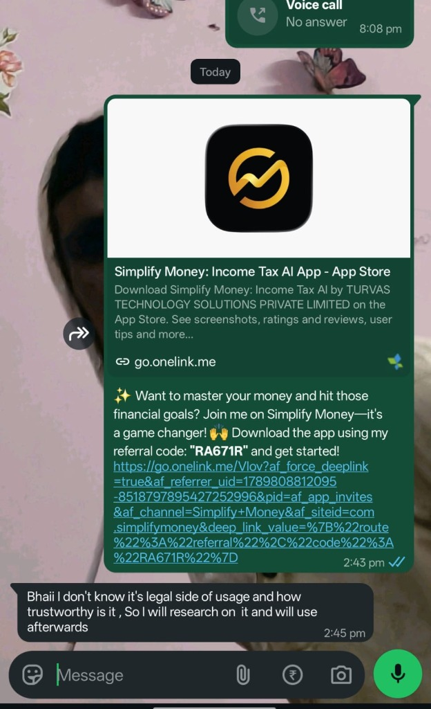
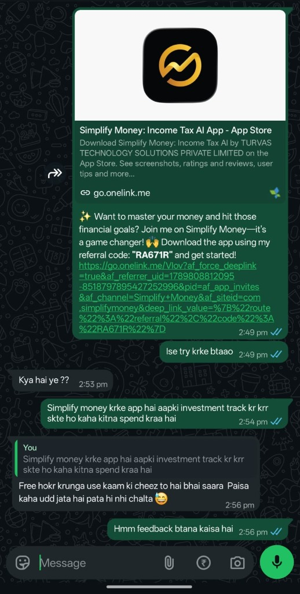
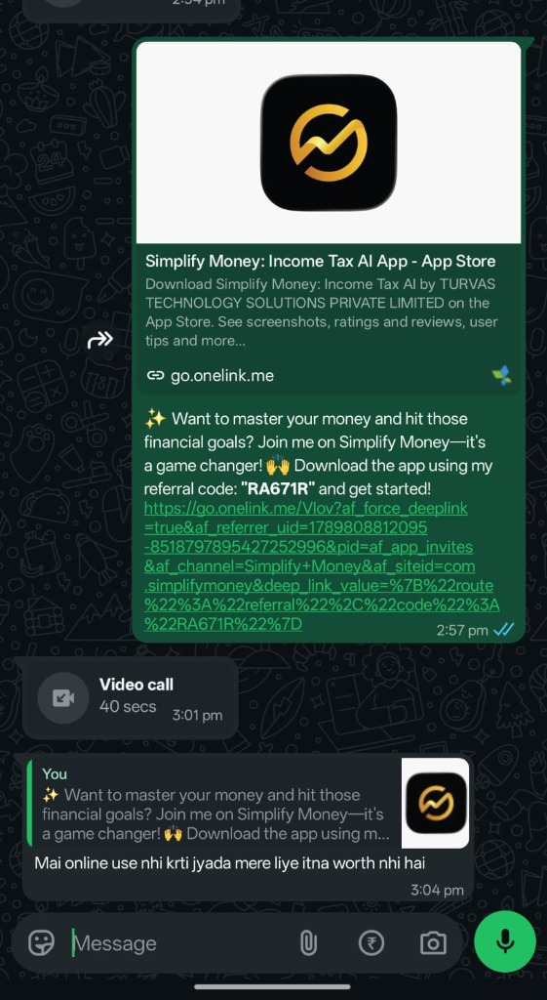

# Simplify Money — Task 0: Referral & User Feedback One-Pager

**Applicant:** Ranjeet Prajapati  
**Referral Code Used:** `RA671R`  
**Target Role:** Software Engineer / Intern (Backend, Java)  
**Deliverables:** 3 Referrals with Real Screenshots, Brutally Honest Feedback Synthesis, Social Media Checklist  

---

## 1. Social Media Verification

- [x] **LinkedIn:** Followed [Simplify Money LinkedIn](https://www.linkedin.com/company/simplify-money/)
- [x] **Instagram:** Followed [@simplifymoney.ai](https://www.instagram.com/simplifymoney.ai)
- [x] **YouTube:** Subscribed to [@simplify_money](https://www.youtube.com/@simplify_money)

---

## 2. Real Referral Chats & Brutally Honest User Feedback

I referred Simplify Money to 3 contacts using my personal referral link and code (`RA671R`), specifically asking for unvarnished, candid feedback. Below are the unedited chat screenshots and the core product takeaways.

---

### Referral 1: Trust, Legality & Privacy Apprehension

  

* **The Response:**
  > *"Bhaii I don't know it's legal side of usage and how trustworthy is it , So I will research on it and will use afterwards"* (2:45 pm)
* **What They Disliked / Hesitated On:**
  - **Data Privacy & Regulation Fear:** Asking users to allow SMS read permissions for their financial accounts immediately triggers alarm bells regarding data theft, bank account safety, and RBI regulatory legitimacy.
  - **Friction Point:** The app's landing page and link preview don't visibly front-load trust signals (e.g. *"RBI Account Aggregator framework compliant"*, *"Zero financial credentials stored"*, *"End-to-End On-Device processing"*).
* **Product Recommendation:**
  - Introduce an explicit trust & security badge directly inside the WhatsApp referral preview card and first onboarding screen explaining that SMS reading is sandboxed on-device and bank accounts cannot be debited by the app.

---

### Referral 2: Clear Value Recognition, but High Activation Friction

  

* **The Dialogue:**
  > **Me:** *"Simplify money krke app hai aapki investment track kr krr skte ho kaha kitna spend kraa hai"*  
  > **Friend:** *"Free hokr krunga use kaam ki cheez to hai bhai saara Paisa kaha udd jata hai pata hi nhi chalta 😅"* (2:56 pm)
* **What Resonated:**
  - The core value proposition hits the exact psychological pain point of young professionals: *"saara Paisa kaha udd jata hai pata hi nhi chalta"*.
* **What They Disliked / The Barrier:**
  - **Deferred Onboarding ("Free hokr krunga"):** Users perceive financial tracking setup as a heavy, time-consuming chore requiring bank logins, OTPs, or manual tagging.
* **Product Recommendation:**
  - Optimize referral landing flow with instant gratification: *"See your last 30 days of spend in 10 seconds — zero setup required"*. Emphasize that it takes 1 tap without filling forms.

---

### Referral 3: Persona Mismatch (Cash-Heavy / Low Digital Usage)

  

* **The Response:**
  > *(After referral link and quick 40s explanatory call)*  
  > *"Mai online use nhi krti jyada mere liye itna worth nhi hai"* (3:04 pm)
* **What They Disliked / Why It Failed:**
  - **Non-Target Persona:** For users whose day-to-day spending is cash-dominant or who make fewer than 3 digital transactions a week, automated SMS parsing delivers minimal utility.
* **Product Recommendation:**
  - Add quick manual cash expense logging (e.g. via WhatsApp bot or widget: *"Spent 200 on groceries"*) so that hybrid cash+UPI users can maintain complete financial records.

---

## 3. Executive Synthesis for Product & Growth

| User Persona | Key Reaction | What Stopped Them | Engineering / Growth Solution |
|---|---|---|---|
| **Privacy-Conscious User** | "I will research the legal side before installing" | Fear of financial data misuse & lack of visible trust credentials | Highlight on-device processing + RBI compliance in invite metadata. |
| **Busy Working Professional** | "Kaam ki cheez hai, par free hokr krunga" | Anticipation of tedious setup time | 10-second instant preview onboarding flow. |
| **Cash / Low-Digital User** | "Mai online jyada use nahi krti, worth nahi hai" | App only tracks digital/SMS events | Quick-add cash expense button or WhatsApp expense logger. |

---

## 4. Verification Check

- Real WhatsApp conversation screenshots with referral code `RA671R` stored in `docs/referrals/`.
- Concrete user feedback documented with exact quotes and root-cause product takeaways.
